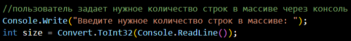
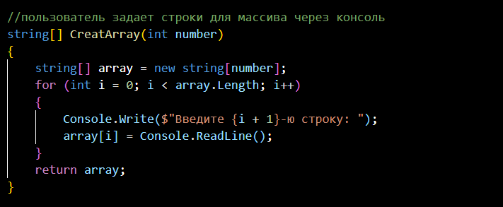
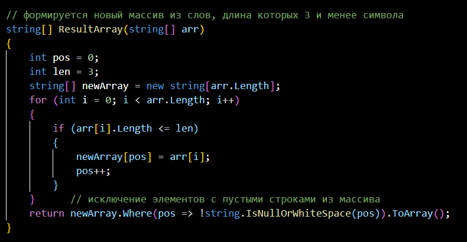
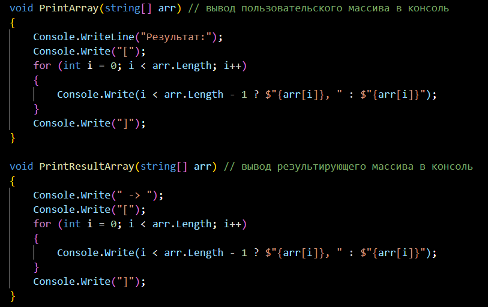
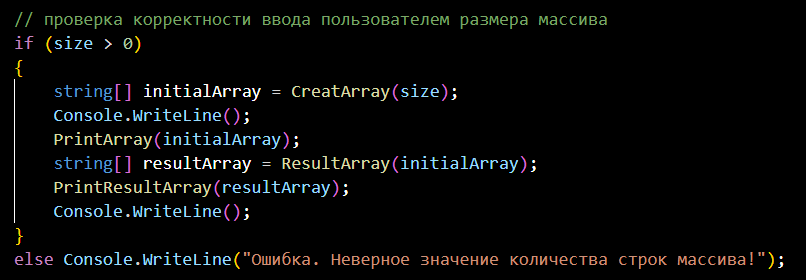

# Итоговая проверочная работа
## Задача :

Написать программу, которая из имеющегося массива строк формирует массив из строк, длина которых меньше либо равна 3 символа. Первоначальный массив можно ввести с клавиатуры, либо задать на старте выполнения алгоритма. При решении не рекомендуется пользоваться коллекциями, лучше обойтись исключительно массивами.

## Описание алгоритма решения:

Пользователь указывает сколько элементов (size) он хочет задать

 

и заполняет стартовый массив элементами в цикле size-раз.

 

Далее проходим по стартовому массиву в цикле и проверяем, подходит ли элемент условию "длина символов строки <= 3". Если элемент подходит под данное условие, то мы добавляем его в новый массив, используя при этом дополнительный счетчик, чтобы элементы в новом массиве заполнялись последовательно (без пропусков).

Для вывода результатов в консоль используем два метода:

Также делаем проверку корректности ввода данных пользователем для возможности реализации поставленной задачи:

Графическое представление решения задачи на блок-схеме:

Решил задачу студент курса "Разработчик" _Ашрафзянов В.М._